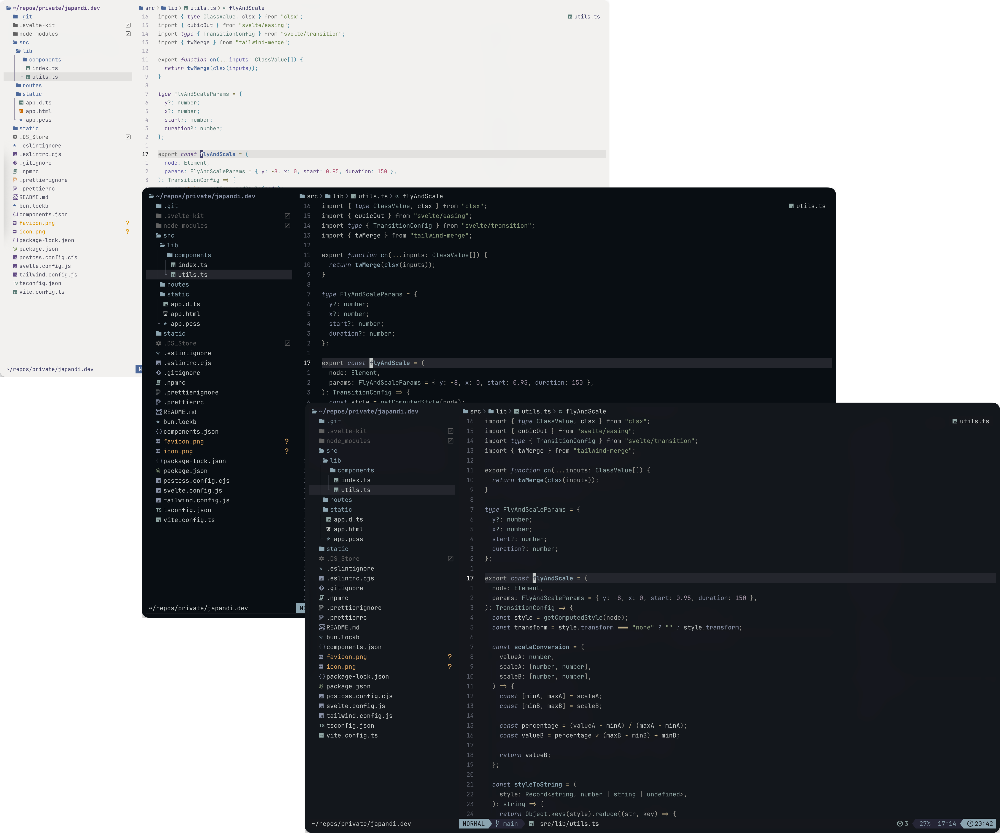
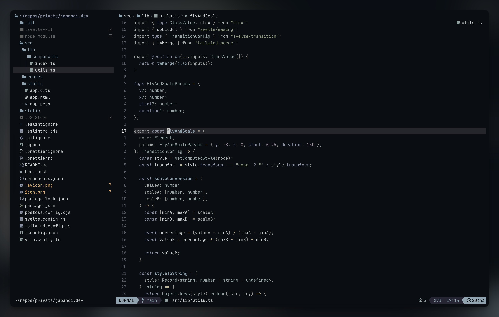
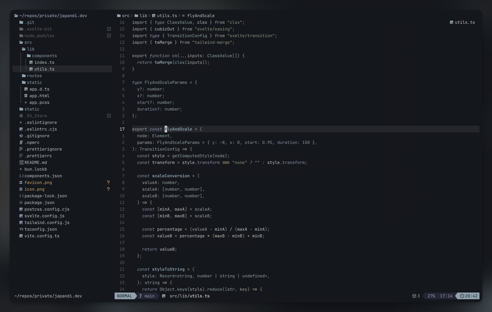
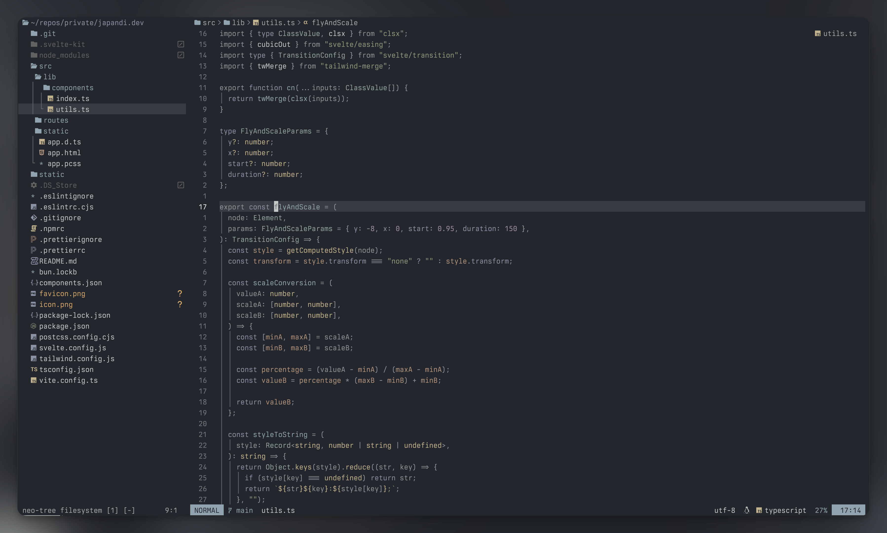
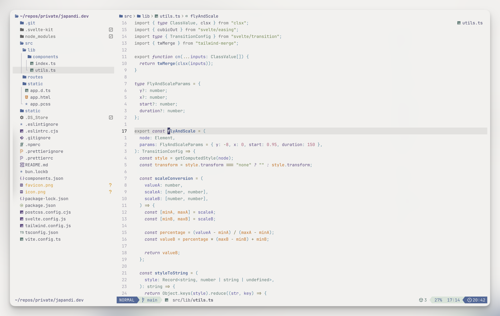

<div align="center">
  <h1>🌊 Kansō.nvim 🌊</h1>
</div>

<div align="center">
  <p>
    Kansō is an elegant evolution of the original Kanagawa theme.
    <br/>
    A dark theme that invites <em>focus</em>, not attention.
  </p>
</div>

<div align="center">

[](https://neovim.io/)
[](https://www.w3.org/TR/WCAG21/#contrast-minimum)

  
</div>

<br/>

<div>
  
</div>

## ✨ Features

- 🌈 Extensive support for `TreeSitter` syntax highlighting
- 🔌 Compatible with popular plugins out of the box
- ⚡ Compilation to lua byte code for fast startup times
- 🎨 Four beautiful theme variants to match your mood and environment
- 🔆 Saturated mode for enhanced syntax highlighting visibility
- 👁️ WCAG 2.1 AA compliant

## 📦 Installation

Download with your favorite package manager.

```lua
-- Using Lazy
{
  "webhooked/kanso.nvim",
  lazy = false,
  priority = 1000,
}

-- Using Packer
use "webhooked/kanso.nvim"
```

## 📋 Requirements

- Terminal with truecolor support
- Terminal with undercurl support (optional)

## 🚀 Usage

As simple as writing:

```vim
colorscheme kanso
```

Or in Lua:

```lua
vim.cmd("colorscheme kanso")
```

## ⚙️ Configuration

There is no need to call setup if you are ok with the defaults.

```lua
-- Default options:
require('kanso').setup({
    bold = true,                 -- enable bold fonts
    italics = true,             -- enable italics
    compile = false,             -- enable compiling the colorscheme
    undercurl = true,            -- enable undercurls
    commentStyle = { italic = true },
    functionStyle = {},
    keywordStyle = { italic = true},
    statementStyle = {},
    typeStyle = {},
    transparent = false,         -- do not set background color
    dimInactive = false,         -- dim inactive window `:h hl-NormalNC`
    terminalColors = true,       -- define vim.g.terminal_color_{0,17}
    colors = {                   -- add/modify theme and palette colors
        palette = {},
        theme = { zen = {}, pearl = {}, ink = {}, all = {} },
    },
    overrides = function(colors) -- add/modify highlights
        return {}
    end,
    background = {               -- map the value of 'background' option to a theme
        dark = "ink",           -- try "zen", "mist" or "pearl" !
        light = "ink"           -- try "zen", "mist" or "pearl" !
    },
    foreground = "default",      -- "default" or "saturated" (can also be a table like background)
})

-- setup must be called before loading
vim.cmd("colorscheme kanso")
```

<details>
<summary><strong>💡 Important Notes</strong></summary>

**Compilation:** If you enable compilation, make sure to run `:KansoCompile` command every time you make changes to your config.

```vim
" 1. Modify your config
" 2. Restart nvim
" 3. Run this command:
:KansoCompile
```

**Options:** Kansō adjusts to the value of some options. Make sure that the options `'laststatus'` and `'cmdheight'` are set **_before_** calling `setup`.

</details>

## 🎨 Themes

Kansō comes in four beautiful variants:

- `Zen` (Dark)
- `Ink` (Dark)
- `Mist` (Dark)
- `Pearl` (Light)

<div>
  <h3>✧ Zen ✧</h3>
  <p>Deep & rich dark theme for focused coding.</p>
  
  <br/><br/>

  <h3>✧ Ink ✧</h3>
  <p>Balanced theme with elegant colors.</p>
  
  <br/><br/>

  <h3>✧ Mist ✧</h3>
  <p>Soft & muted dark theme with gentle colors.</p>
  
  <br/><br/>

  <h3>✧ Pearl ✧</h3>
  <p>Light theme for daytime productivity.</p>
  
</div>

<br/>

<details>
<summary><strong>🔄 Switching Between Themes</strong></summary>

Themes can be changed in three ways:

1. Setting `config.theme` to the desired theme.
2. Using the `background` option:
   Any change to the value of `vim.o.background` will select the theme mapped by `config.background`.
3. Loading the colorscheme directly with:

```lua
vim.cmd("colorscheme kanso-zen")
vim.cmd("colorscheme kanso-ink")
vim.cmd("colorscheme kanso-mist")
vim.cmd("colorscheme kanso-pearl")
```

or

```lua
require("kanso").load("zen")
```

</details>

## 🌟 Foreground Saturation

Kansō now supports a foreground saturation option that enhances the saturation of syntax highlighting colors while keeping the same background colors. This is useful for improving visibility in certain lighting conditions or personal preference.

<details>
<summary><strong>🔆 Using Saturated Mode</strong></summary>

The `foreground` option can be configured per background mode:

```lua
require('kanso').setup({
    foreground = {
        dark = "default",    -- Use default colors in dark mode
        light = "saturated"   -- Use higher saturation in light mode
    },
})
```

When set to `"saturated"`, syntax highlighting colors will have increased saturation making them stand out more against the background:

- Zen, Ink, and Mist themes: 20% more vibrant colors
- Pearl theme: 40% more vibrant colors

This is particularly useful:

- In bright environments where you need more color distinction
- For users who prefer more vibrant syntax highlighting
- When using the light themes where increased saturation can be beneficial

The saturation adjustment only affects syntax highlighting colors (strings, keywords, functions, etc.) and does not change UI elements or background colors.

</details>

## 🧰 Customization

In Kansō, there are _two_ kinds of colors: `PaletteColors` and `ThemeColors`;
`PaletteColors` are defined directly as RGB Hex strings, and have arbitrary names
that recall their actual color. Conversely, `ThemeColors` are named and grouped _semantically_
on the basis of their actual function.

In short, a `palette` defines all the available colors, while a `theme` maps the `PaletteColors`
to specific `ThemeColors` and the same palette color may be assigned to multiple theme colors.

<details>
<summary><strong>📝 Color Customization Example</strong></summary>

You can change _both_ theme or palette colors using `config.colors`.
All the palette color names can be found [here](lua/kanso/colors.lua),
while their usage by each theme can be found [here](lua/kanso/themes.lua).

```lua
require('kanso').setup({
    ...,
    colors = {
        palette = {
            -- change all usages of these colors
            zen0 = "#000000",
            fujiWhite = "#FFFFFF",
        },
        theme = {
            -- change specific usages for a certain theme, or for all of them
            zen = {
                ui = {
                    float = {
                        bg = "none",
                    },
                },
            },
            ink = {
                syn = {
                    parameter = "yellow",
                },
            },
            all = {
                ui = {
                    cursor_line_nr_active_foreground = "#C4746E"
                }
            }
        }
    },
    ...
})
```

</details>

<details>
<summary><strong>🔧 Highlight Group Overrides</strong></summary>

You can also conveniently add/modify any `hlgroups` using the `config.overrides` option, allowing you to customize the looks of specific built-in elements, or any other external plugins that provides `hlgroups`. (See `:help highlight` for more information on `hlgroups`.)
Supported keywords are the same for `:h nvim_set_hl` `{val}` parameter.

```lua
require('kanso').setup({
    ...,
    overrides = function(colors)
        return {
            -- Assign a static color to strings
            String = { fg = colors.palette.carpYellow, italic = config.italics },
            -- theme colors will update dynamically when you change theme!
            SomePluginHl = { fg = colors.theme.syn.type, bold = true },
        }
    end,
    ...
})
```

</details>

## 🔄 Integration

### Get palette and theme colors

```lua
-- Get the colors for the current theme
local colors = require("kanso.colors").setup()
local palette_colors = colors.palette
local theme_colors = colors.theme

-- Get the colors for a specific theme
local zen_colors = require("kanso.colors").setup({ theme = 'zen' })
```

## 🧩 Extras

<div>

- [Alacritty](extras/alacritty/)
- [Kitty](extras/kitty/)
- [Ghostty](extras/ghostty)
- [Foot](extras/foot/)
- [Wezterm](extras/wezterm/)
- [iTerm2](extras/iterm)
- [Yazi](extras/yazi/)
- [Zathura](extras/zathura/)
- [Zellij](extras/zellij/)
- [Windows Terminal](extras/windows-terminal/)
- [Kansō for VS Code](https://marketplace.visualstudio.com/items?itemName=webhooked.kanso-theme)
- [Kansō for Zed](https://github.com/webhooked/kanso-zed)

</div>

## 💎 Credits

The theme is inspired by the Kanagawa theme.

- [rebelot](https://github.com/rebelot/kanagawa.nvim) for the original Kanagawa Neovim theme

## 🙏 Acknowledgements

- [Kanagawa](https://github.com/rebelot/kanagawa.nvim)
- [Tokyonight](https://github.com/folke/tokyonight.nvim)
- [Gruvbox](https://github.com/morhetz/gruvbox)
- [Catppuccin](https://github.com/catppuccin/nvim)
